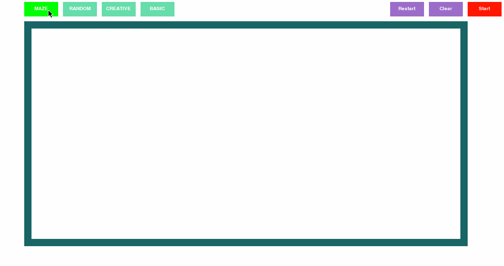
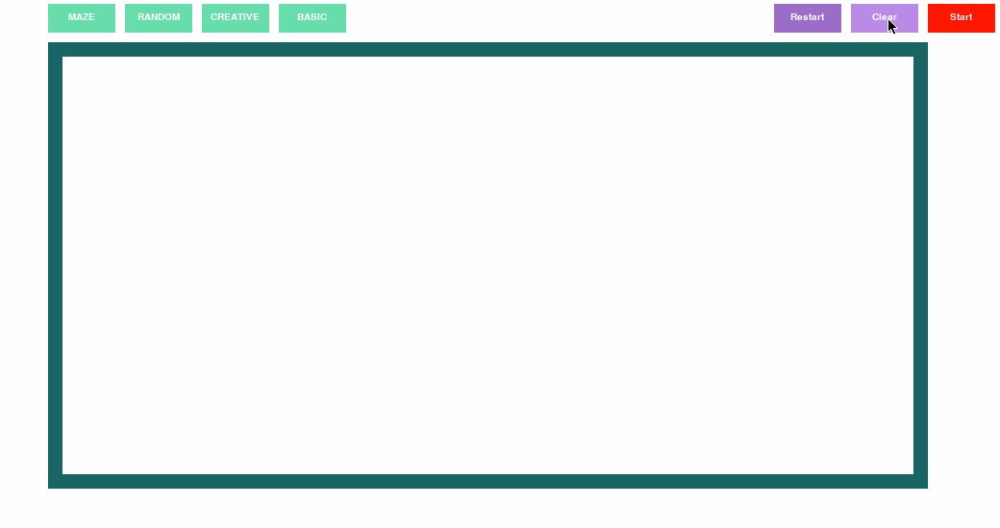
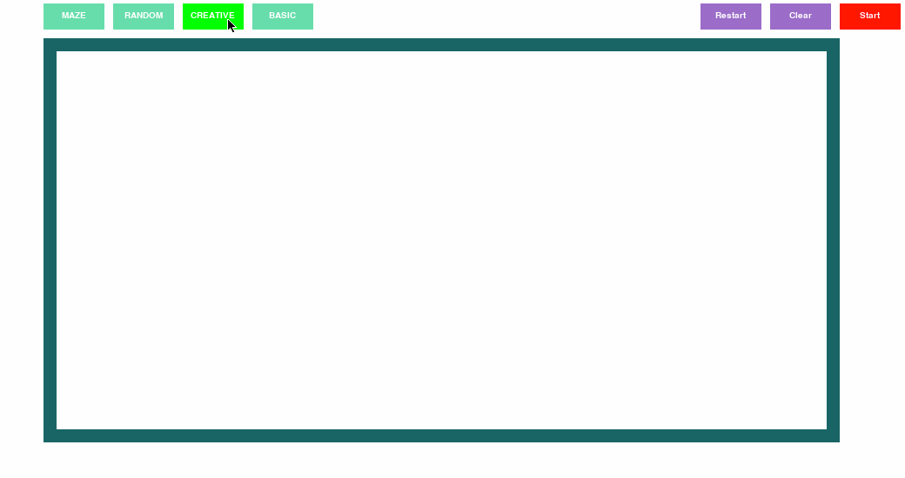

# A* Pathfinding Algorithm Visualizer
This is my first attempt at A* pathfinding. I made this visualization out of interest for pathfinding. 

## Brief path explanations:
The A* pathfinding algorithm is one of the most efficient pathfinding algorithms which finds the shortest distance in the most optimal time. The algorithm uses a heuristic to determine the direction for which the path needs to travel. The node is allowed to travel diagonally by default [You can change this in the node.py file to make it only follow horizontal and vertical movements]

The Closed Set, denoted by the purple path represents the nodes that the algorithm has visited. The Open Set, denoted by the turquoise path represents the nodes that the algorithm will visit next. The golden path represents the most optimal path from point A to the current position the algorithm is working on. This path is updated in real-time so the user can see where the algorithm is working during the process. Play around with the visualizer... you'll find yourself creating some pretty crazy paths... and trust me when I say this, this has been one of the most visually satisfying projects yet. Youll get what I mean as you play around with the settings.

## Reqs.
You must create a map to start the pathfinding. The Orange node represents the start node, the brown nodes represent checkpoints
(ie: points the algorithms needs to pass in order to complete the path), and the red node represents the goal node.
Note: The user has the option to not include checkpoints

This pathfinding program requires the Pygame library in order to run. Without it, errors will arise, unfortunately

## Instructions
1) Run index.py to run the main file

2) Select a map
Maze: Able to select start, goal, checkpoints
Random: Able to select the rate of walls spawning. Recommended spawn rate is 0-30%. Able to select start, goal, checkpoints, and walls
Creative: Able to select start, goal, checkpoints, and walls. 
Basic: Able to select start, goal and checkpoints

3) When Selecting checkpoint nodes: 
- You may select as many CPs as you want
- These are not goal nodes. The algorithm will be forced to reach them in the order they were placed. If there exists an unreachable CP, then there will be no final path.

3) When selecting wall nodes:
 - Option 1 allows you to select a 1x1 square
 - Option 2 allows you to select a 3x3 square without the center
 - Option 3 allows you to select a 1x3 rect.
 - Option 4 allows you to select a 3x1 rect.
 

Start button:
Self explanatory .-. The user must select start and goal nodes to start the visualization.

Clear button:
This option clears the board. The user must reselect the start and goal nodes in order to start the path.

Restart Button:
This option resets all the paths to default (including the paths, closed set and open set) without deselecting the nodes placed by the user.
After the board is reset the user can select the start button to re-visualize the path

## A few demos:

## Future plans: 
- Once I have a bit of time on my hands I plan on scratching pygame and having the display in HTML where I use flask to
concatonate my program in python with a server. I will use CSS to style the visualizer.
- Will add the feature of saving maps where the user is able to rerun the map they had saved previously.

 
